# i-Guessture
## Introduction  
With the advancements in deep learning and computer vision, human-computer interaction using hand-gestures has been considerably improved to provide a more natural, simplistic and intuitive user interface for fluid communication with machines.

The idea of this project is to design a camera-based hand recognition system using state-of-the-art convolutional neural networks that allows an individual to control his/her personal computer using a collection of predefined hand-gestures without additional computer peripheral devices. Each hand-gesture is mapped to its corresponding computer-activity which is triggered soon after the gesture is inferred following the user’s hand detection.

## Quick Instructions For Use
## i-Guessture Program
1. To run controller.py on **normal mode**, type the following command in the terminal:  
	 `python controller.py`
2. To run controller.py on **debug mode**, type the following command in the terminal:  
	 `python controller.py 1`
3. To save current image-frame for training, press 'w' button
4. To quit the program, give a 'No'/'Shutdown Program' gesture (or) press 'q' button

**Note:** The program may halt and throw an error if the lighting conditions are unfavourable for hand-segmentation purposes.  

## Convolutional Neural Network Model-Training Script
1. To **train** the CNN model, type the following command in the terminal:  
	 `python trainingPhase.py`  
   (ensure that all the images are in the path 'images/X/x.png', where X = {One, Two, Yes, No, Fist} and x = X.lowercase()) 
2. To **test** the CNN model with one instance, type the following command in the terminal:  
	 `python trainingPhase.py 1`  
   (ensure 'classifierModel.h5' model exists in the directory)  
   Enter the path of the image file as requested to predict its label.

## Acknowledgement
1. My mentor, Dr. Nikolaos Papanikolopoulos, a respected computer-vision practitioner and professor at the University of Minnesota - Twin Cities, without whose support this project would not have been possible.
2. The online-community resources in general, which assisted me in learning about TensorFlow and other novel state-of-the-art libraries and frameworks. 

## Literature Review
Vision-based hand-gesture recognition systems have been used in numerous applications such as interactive touchless automotive user interfaces [5], mobile-phone user authentication [8] and sign language recognition [6]. However, there is not much work pertaining to the implementation of these recognition systems in controlling machines.

Although a few experts have attempted to apply the hand recognition concepts in controlling the Microsoft Powerpoint software [2], Media Player [9] and Windows OS [1], these applications are based on lazy learning algorithms like K-Nearest Neighbor and are thus prone to a delayed responsive performance due to the time-consuming gesture prediction phase. The works in controlling a computer from [10] do implement a basic MLP neural network structure but this structure does not share the advantages of a CNN-design neural network. Thus, the comparison of effectiveness between the authors’ proposed wavelet network classifier (which was deemed to be better in performance) with a MLP neural network may not be completely justified. 

The goal of this project is highlight the effectiveness of the novel state-of-the-art deep learning algorithms in hand-gesture recognition in controlling a PC without the need of peripheral devices with the exception of a web-camera. At a high level, this project consists of six primary components - (i) image sequence acquisition, (ii) hand-detection, (iii) gesture-recognition, and (iv) computer-activity execution, identical to the one mentioned in [1]. The image acquisition phase is performed using utilities and supporting functionalities provided by OpenCV [7]. The business logic component of this project, motivated by [11], [12] and [13], is based on the procedure coupling a GMM [11] for hand detection with a CNN for gesture recognition [3] to account for the temporal aspect of the gestures. A finite set of about 5 gestures would be incorporated into the system which draws inspiration from those listed in [4].

## Software Technologies and Library Dependencies
The entire application has been programmed, debugged and tested in the Python programming language using Python’s standard IDLE pre-installed editor on a Windows machine. However, since all of the libraries and software packages used in the development of the hand-detection and gesture-recognition system are platform independent, the program should be able to run on UNIX/Linux machines without any additional difficulties. 

The library dependencies are fulfilled at each component of the HGRS program as per the desired functionality each of them leverage, using the Python Library Stack.

1. **Image Sequence Acquisition:** The computer vision module of python, **OpenCV**, will be used for the acquisition of the sequence of image frames. The OpenCV API abstracts the convoluted low-level procedure of communication between the webcam and human-computer interaction interface, and provides the computer vision expert to process the frames in a chronological fashion. Since, every image storage and manipulation tasks are required to be performed efficiently, **Numpy** library is imported to utilize arrays instead of Python lists which provide a vectorized representation of mathematical operations and enhance the readability of the code, in a way similar to MATLAB.
2. **Hand Detection:** Inspired by the probabilistic model proposed in [11] and [12], a GMM model in the **Scikit-Learn** machine learning package will be used as the color segmentation model for the extraction of the hand pixels from the image. The color model as well as the background model described by the Bayes Rule in [11] would be formulated for each image frame from the captured sequence, and the corresponding image-frame pixels in consideration would be classified as hand pixels or background pixels. A thresholding filter will be applied such that all hand-detected pixels would be transformed to white pixels, while the remaining background pixels will be nullified. 
3. **Gesture Recognition:** The thresholded image containing the hand-pixels is then passed through a trained CNN model [3] available in python’s deep learning framework, **Keras** with **TensorFlow** as its backend. Before incorporating the CNN in the production step of the gesture recognition, the CNN will be trained beforehand using a hand-made dataset, comprising about 500 images each for a unique, static and non-temporal gesture, which is recorded soon after the integration of the GMM hand-detection module. The task of the trained CNN is to provide the gesture label, which is used to identify a computer-activity.
4. **Computer-Activity Execution:** Finally, the computer-activity recognised by the Gesture Recognition module is performed using python’s **PyAutoGUI** library, which enables the automated and programmatic control of the peripheral user-interfaces, such as the mouse. As of May 2018, 5 computer activities, associated with their distinct gestures, have been decided to be incorporated in the application. In future works, the gesture database is expected to be expanded.

## Detailed System Architecture
In reality, i-Guessture has a much more complex and verbose architecture as illustrated below:

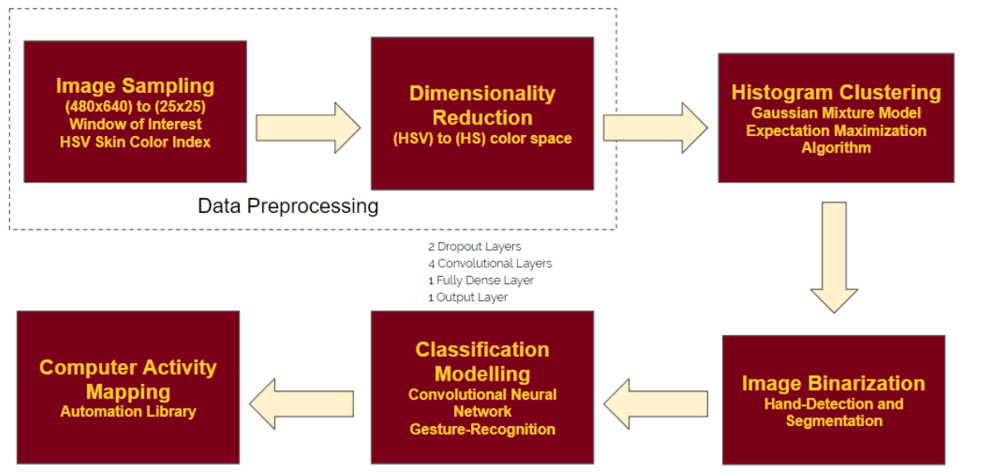

### 1. Data Preprocessing
Before feeding the image frames from the webcam-video live feed capture, it is essential to preprocess the images to a format that is favourable for skin-color clustering and gesture-classification. The initial three modules of the application deal with the Hue-Saturation-Value color space of the captured image frames.

#### Image Sampling
The original video-frame capture had the dimensions of 480x640 pixels square. The area spanned by this image frame was vast enough so as to include unnecessary background details and features. These features were also found to interfere with clustering results in the later stages of dimensionality-testing, by introducing unwanted noises in the image frames thereby creating a histogram distortion for clustering. Therefore, a ‘Window-Of-Interest’ was defined so as to limit the scope of the interest in the webcam-captured frame. The resolution was further lowered to 25x25 by scaling down the image. Finally, to focus on the potential skin-color pixels of the image, an image sampling was carried out wherein all pixel values were required to satisfy the following Hue and Saturation intensity range-constraints:

This HSV skin-color index, as mentioned by Wang et al. in [13], enables a simple yet elegant solution for extraction of possible hand pixels in the frame for varying skin-colors, thereby reducing the number of image-sample points of interest significantly.

#### Dimensionality Reduction
An interesting observation by the authors Yang et al. in [12] reveals that skin-color pixels tend to cluster very close to each other in the RGB color space, especially when the color histogram is viewed in the RG scale. Inspired by this concept of color space  reduction, the dimensionality of the results obtained from image sampling was reduced from HSV to the HS color space. This process proved to be extremely beneficial for clustering phase of skin-pixels, since the implemented GMM model, being sensitive to the dimensionality of the input, had a higher time complexity and produced negligible clustering  improvements for the HSV color space as compared to the results obtained in the the HS color space. As inferred from [12], the focus of skin-detection was to be shifted from the brightness value of a pixel to the actual color-determining properties of the color space, which was accomplished by the HS color space.

### 2. Histogram Clustering
Due to the limitations posed by the HSV skin-color index mentioned in [13], the data-preprocessing results were still known to possess spurious, unwanted and ‘falsely’ detected skin-color pixels. To strengthen the classification of hand-pixels and background pixels as well as motivated by Yang et al.’s hand-segmentation work in [11], a GMM model based on the Expectation Maximization Algorithm was implemented for clustering the hand-pixels from background-pixels. The general idea behind this clustering technique is illustrated in the figure below.

During the course of clustering, an assumption is made that only Gaussian distributions need to be fit to the image-data points, one pertaining to the skin-color distribution and the other relating to the background pixels. The game of estimating the mean and covariance matrix parameters for each of these Gaussian distributions is played by the EM algorithm. It is to be noted that the label, which is provided to each image point, is computed from the probabilistic cluster-assignment results, and thus misclassified cluster labels to each point may avoid removal of spurious and unwanted hand-pixels in hand-pixel detection. The EM algorithm tries to maximize the likelihood of the point image data point given its parameters (mean and covariance matrix) to belong to a cluster label. It is assumed that the algorithm will converge to solution until it reaches a maximum of 200 iterations. To speed up the convergence results for the consecutive video image-frames, the GMM model is tuned to start EM algorithm at the estimated parameters saved from previous image-frames clustering solutions.

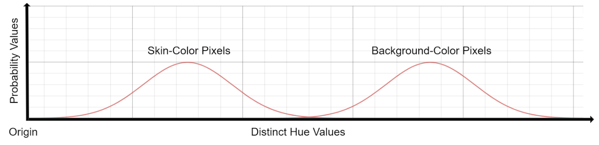

### 3. Image Binarization
Finally, the image is binarized by segmenting the hand, which consists of all points labelled as a hand/skin-color pixel from the GMM clustering step. A test is performed to check whether the number of skin-color pixels detected meet a certain threshold value. This minimizes the fault detection of a hand, even though a small number of spurious pixels were detected in the image frame. Thresholding is performed followed the constraint that all skin-color pixels are colored as white pixels, and the background pixels are colored as black intensity values. Hand-detection is completed in until this process. One successful image binarization is shown below:

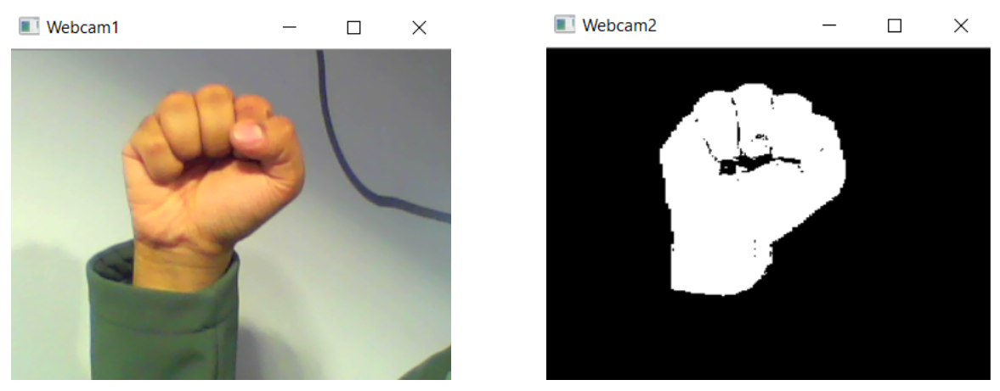

### 4. Classification Modelling
A CNN model [3] was implemented to classify the segmented hand images to their respective gestures. The proposed model has a total of four convolutional layers, each consisting of the ‘conv’ layer of kernel size 5  and a ‘max’ pool layer of pool size 2, one fully-connected layer of size 512, three dropout layers with probability 0.25, 1 of which is placed after the fully-connected layer, and finally an output layer of size 5 (indicating the number of gestures). 

A database of 3500 images were used to train the CNN model for 5 gestures, with 700 images for each gesture. The max-pooling layers are added to control the size of the input features to the next consecutive layers. By deactivating certain nodes at a time, the dropout layers avoid the possibility of overfitting, in which case the CNN would perform exceptionally well on trained data but poorly on unknown test data images. A fully connected-layer is added to combine the mixed signals from various node levels in order to achieve the final ‘one-hot’ result vector. The output vector is the the resultant ‘one-hot’ vector consisting of the probabilistic values of image-input being each of the gestures. To achieve a crisp classification result, the index of the maximum probability value is chosen from the output vector, which is mapped to its corresponding gesture. 

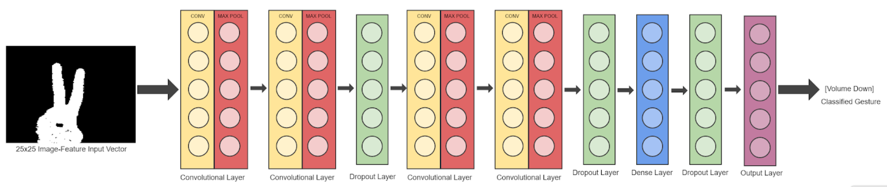

### 5. Computer-Activity Mapping
Five gestures were recorded, trained and maintained in the database for the project. Each of these gestures with their corresponding computer-activity are shown in the figure below. The CNN output was used to map the gesture to the computer-activity. An automation library was used to access the system APIs to simply execute the corresponding activities soon after the hand-detection and gesture-recognition was performed.

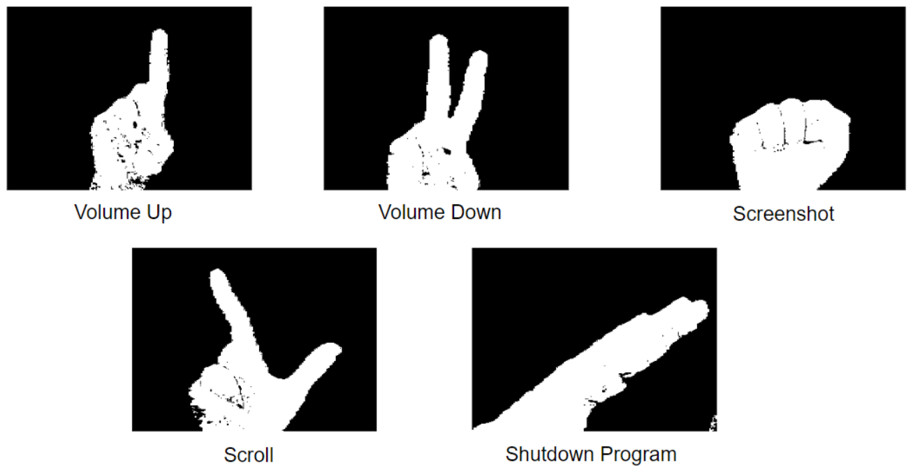

The gestures images have a “key” name associated with it while training and testing, as decided by the developer, and are as follows:

| **Key Name** | **Gesture Name** | 
|:------------:|:----------------:|
| Fist         | Screenshot       |
| One          | Volumne Up       |
| Two          | Volume Down      |
| Yes          | Scroll           |
| No           | Shutdown Program |

## Practical Observations
The performance of the 3500 image-dataset trained CNN model, under ideal working-conditions and provided that the hand was accurately segmented from the image with minimal noise, was found to be about 98.5%, with occasional confusions caused in classifying the ‘Volume Up’ and Volume Down’ gestures. Due to the diverse-space of the clustering results, this classification result may vary depending on several key factors such as environment type and lighting. Earlier, a 2500-images dataset, consisting of 500 images for each gesture class, was trained using the CNN model, but the performance was reported to be about 50% on unseen data. By increasing the image training dataset by 1000 more images, a 97% increase in performance was noticed on unseen images. The performance of the clustering algorithm can be visually viewed the images in Appendix B.

### Ideal Environment Results
The volume is decreased as expected on encountering the “Volume Down” gesture. Thus, the gesture has been recognised correctly.

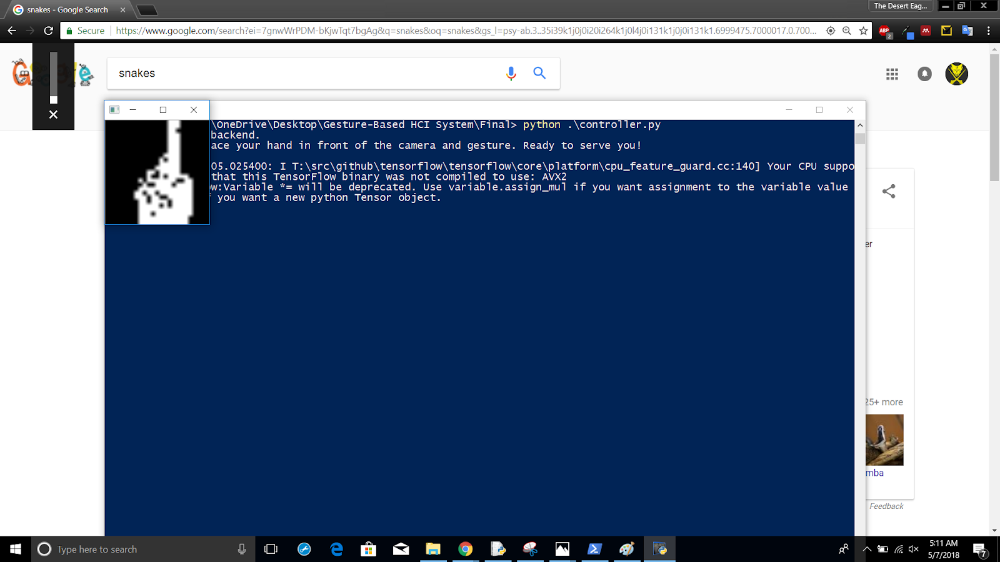

The volume is increased as expected on encountering the “Volume Up” gesture. Thus, the gesture has been recognised correctly.

A screenshot is taken as expected on encountering the “Screenshot” gesture. Thus, the gesture has been recognised correctly.

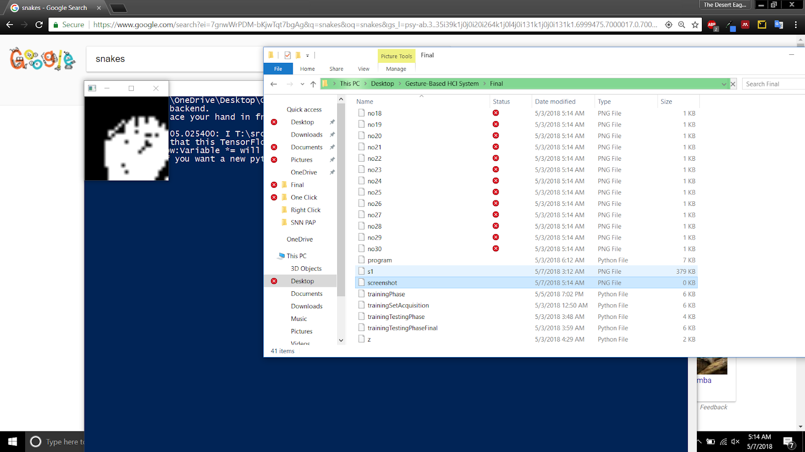

The Google Chrome web-browser page is scrolling as expected on encountering the “Scroll” gesture. Thus, the gesture has been recognised correctly.

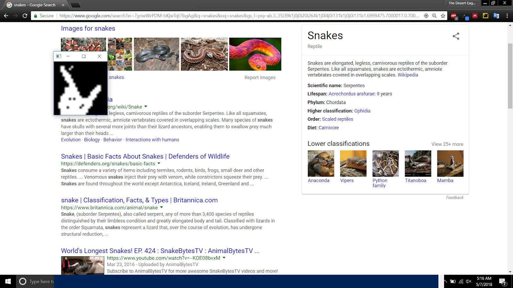

### Noisy Environment
The volume is decreased as expected on encountering the “Volume Down” gesture. Thus, the gesture has been recognised correctly.

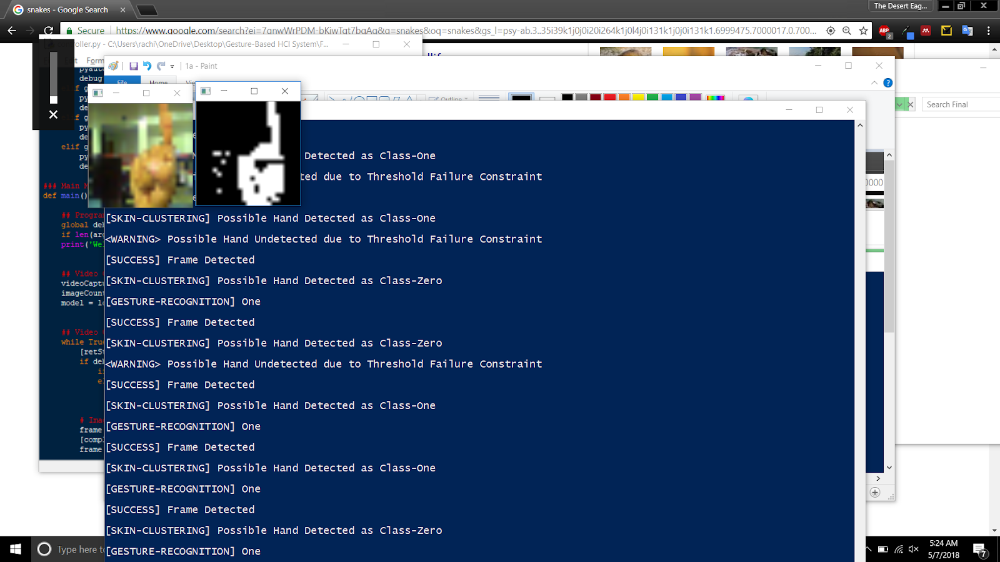

The volume is increased as expected on encountering the “Volume Up” gesture. Thus, the gesture has been recognised correctly. It should be noted that some of the spurious skin-color pixels have been misclassified as skin-color pixels.

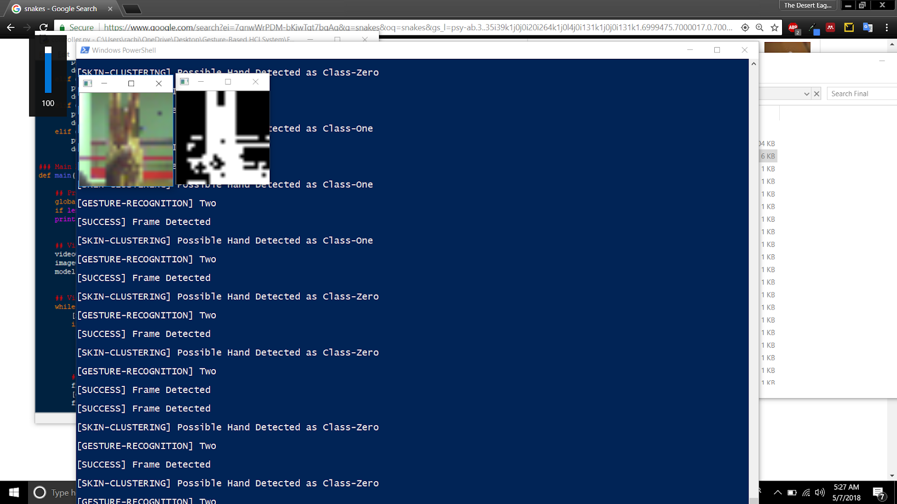

The screenshot is captured as expected on encountering the “Screenshot” gesture. Thus, the gesture has been recognised correctly.

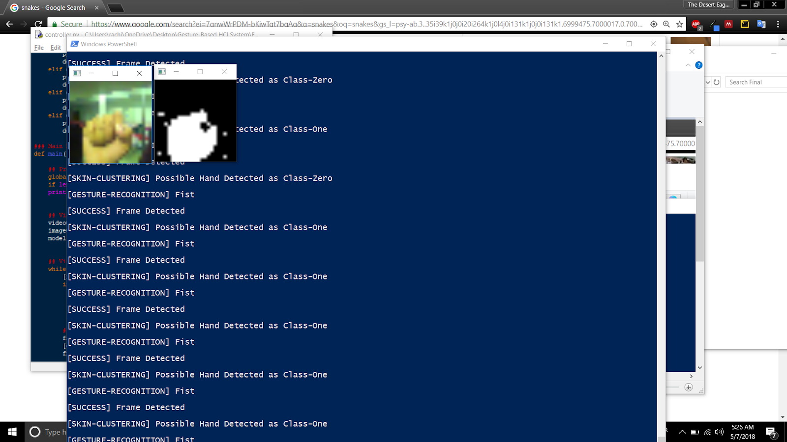

The Python IDLE code page scrolls as expected on encountering the “Scroll” gesture. Thus, the gesture has been recognised correctly.

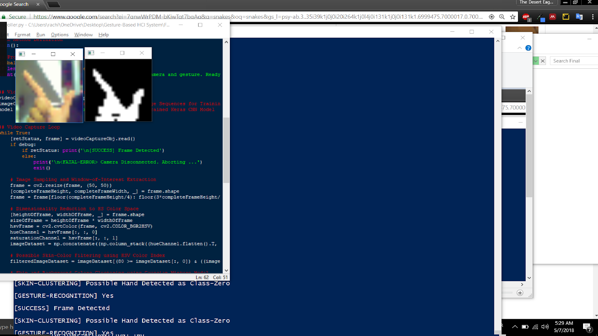

### Perceived Benefits
1. **Quick Gesture Recognition Solution:** By utilizing the fastest mixture model for clustering, i-Guessture proved to be responsive and time-effective which could be deployed in real-time situations after polishing the application. The smaller image-feature space (25x25) with sampled image data-points for clustering proved to be beneficial for accomplishing the speed of hand-detection. 
2. **Complex Task-Gesture Mapping:** Mapping of complex tasks, such as launching an application with a particular gesture, can be accomplished using i-Guessture, provided the gesture is not over-recorded at that instant to avoid multiple launches of the same application, in this case. It can save time efficient by avoiding manual searching and opening of an application.
3. **Different Skin-Color Support:** i-Guessture, based on HSV skin-color indexing, dimensionality reduction and skin-color clustering, was robust to a certain degree of varying skin-colors, as opposed to the traditional image segmentation methods relying on a single threshold intensity value.

### Potential Drawbacks
1. **No Occluded-Gesture Support:** Complex gestures created using a combination of fingers or hands may not supported due to the existence of occlusions.
2. **Camera Calibration:** i-Guessture was tested on a cheap webcam peripheral. Thus, distinct blue or yellow tinges in the video-captured frames were found to hinder the color histogram occasionally. The camera needs to be calibrated to handle lhe light exposures impact on the webcam capture. The ‘garbage in, garbage out’ philosophy is central to i-Guessture.
2. **Brownish/Skin Background:** The presence of tree-wood, human faces or any brownish/skin-colored backgrounds may distort the histogram, which may lead to unexpected skin-clustering results. 

## Future Works
In future works, due to the training-ability of i-Guessture, it is expected to extend the database of gestures by training new images. The need of a pointing peripheral device may be completely eradicated by monitoring the centroid of the ‘Fist’ gesture for controlling the cursor position. Finally, comprehensive study on camera calibration would help in setting up a more suitable and robust environment for the usability of the HGRS system. It is also planned to integrate i-Guessture with future NLP projects on novel HCI systems.

## Conclusion
From the project, It was inferred that simple yet effective solutions, such as the GMM clustering approach coupled with HSV color indexing, can drastically improve the performance of HGRS systems in terms of speed, computation and accuracy. However, skin-color detection is not a trivial task, especially when only a part of the body in the image-frame is to be processed. However, in the gist of building such real-time systems, it is crucial to keep in mind the fundamentals and challenges governing these CV-based systems, the most notable one being camera calibration. Finally, it can be concluded from the project that i-Guessture, and other related Hand=Detection and Gesture-Recognition Systems hold a promising future for HCI user interfaces, especially with the current revival and advancement of CV and ML algorithms in conjunction with powerful graphical processing units.

## References
[1]     H. M. Abdul-Rashid, L. Kiran, M. D. Mirrani and M. N. Maraaj, “CMSWVHG-Control MS Windows via Hand Gesture” in Intl. Multitopic Conf., Lahore, Pakistan, pp. 1-7, 2017.

[2]     T. P. Salunke and S. D. Bharkad, “Power Point Control Using Hand Gesture Recognition Based on Hog Feature Extraction And K-NN Classification” in Proc. of Intl. Conf. on Comp. Methodologies and Comm., Erode, India, pp. 1151-1155, 2017. 

[3]     M. Asadi-Aghbolaghi, A. Clapes, M. Bellantonio, H. J. Escalante, V. Ponce-Lopez et al., “A survey on deep learning based approaches for action and gesture recognition in image sequences” in intl. Conf. on Auto. Face & Gesture Recognition, pp. 476-483,  2017.

[4]     V. Bobic, P. Tadic, G. Kvascev, “Hand gesture recognition using neural network based techniques” in Symp. on Neural Net. and Apps., Belgrade, Serbia, 2016.

[5]     V. John, M. Umetsu, A. Boyali S. Mita, M. Imanishi et el., “Real-time Hand Posture and Gesture-based Touchless Automotive User Interface using Deep Learning”, in IEEE Intell. Vech. Symp., Redondo Beach, CA, pp. 869-874, 2017.

[6]     J. Huang, W. Zhou, H. Li, W. Li, “Sign Language Recognition using 3D Convolutional Neural Networks”, in IEEE Int. Conf. on Multimedia and Expo, Turin, Italy, 2015

[7]     OpenCV, 2017. [Online]. Available: https://opencv.org/ [Accessed: 25-Feb-2018]

[8]     K. Khare and T. Moh, “Mobile Gesture-Based iPhone User Authentication” in Intl. Conf. on Big Data, Santa Clara, CA, pp. 1615-1621, 2015. 

[9]     S. S. Rautaray and A. Agrawal, “A Novel Computer Interface Based On Hand Gesture Recognition Using Computer Vision Techniques” in Proc. Intl. Conf. on Intell. Interactive Tech. and Multimedia, pp. 292-296, 2010.

[10]    T. Bouchrika, M. Zaied, O. Jemai, C. B. Amar, “Neural solutions to interact with computers by hand gesture recognition”, in Multimedia Tools and Apps., Springer, pp. 2949-2975, 2014. 

[11]    X. Zhu, J. Yang and A. Waibel, “Segmenting Hands of Arbitrary Color” in IEEE Intl. Conf. on Automatic Face and Gesture Recognition, pp. 446-453, 2000.

[12]   J. Yang, R. Stiefelhagen, U. Meter and A. Waibel, “Visual tracking for multimodal human computer interaction” in SIGCHI Conf. on Human Factors in Comp. Sys., pp. 140-147, 1998.	

[13]    Y. Wang, J, Syu, H. Li and L. Yang, “Fast Hand Detection and Gesture Recognition”, IEEE Intl. Conf. on Machine Learning and Cybernetics, pp. 408-413, 2015.

## Appendix A: General Abbreviations

| **Abbreviations** | **Description**              | 
|:-----------------:|:----------------------------:|
| CV                | Computer Vision              |
| CNN               | Convolutional Neural Network |
| EM                | Expectation Maximization     |
| GMM               | Gaussian Mixture Model       |
| HCI               | Human Computer Interaction   |
| HS                | Hue-Saturation               |
| HSV               | Hue-Saturation-Value         |
| ML                | Machine Learning             |
| NLP               | Natural Language Processing  |
| OS                | Operating System             |
| PC                | Personal Computer            |
| RG                | Red-Green                    |
| RGB               | Red-Green-Blue               |
| WOI               | Window Of Interest           |

## Appendix B: Sample Hand-Segmentation Outputs
All of the images shown below have been scaled for viewing purposes. It can be seen for numerous positions for each of the hand-gestures, the GMM clustering model was able to segment the hand accurately. It may be noted that the 'Volume Down' gesture did get misclassified as the ‘Scroll’ or 'Volume Increase' gesture rarely.

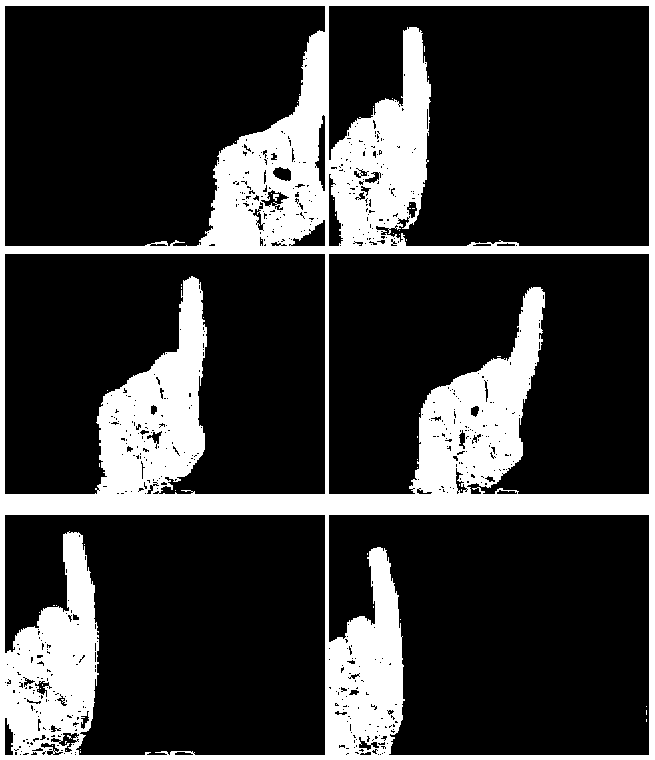

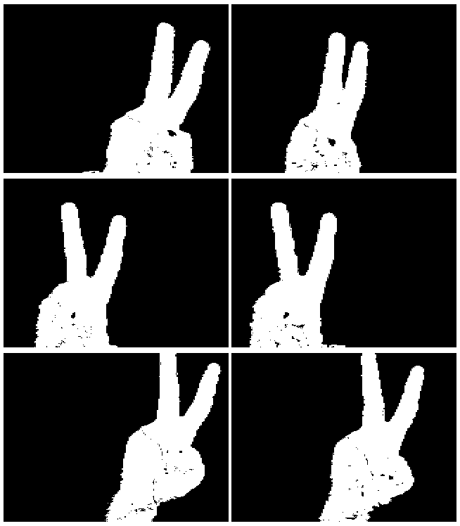

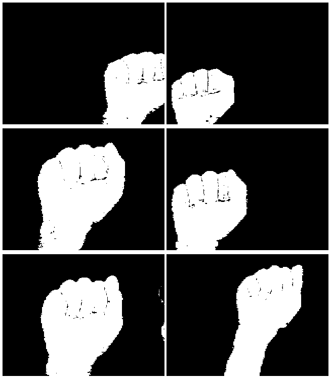

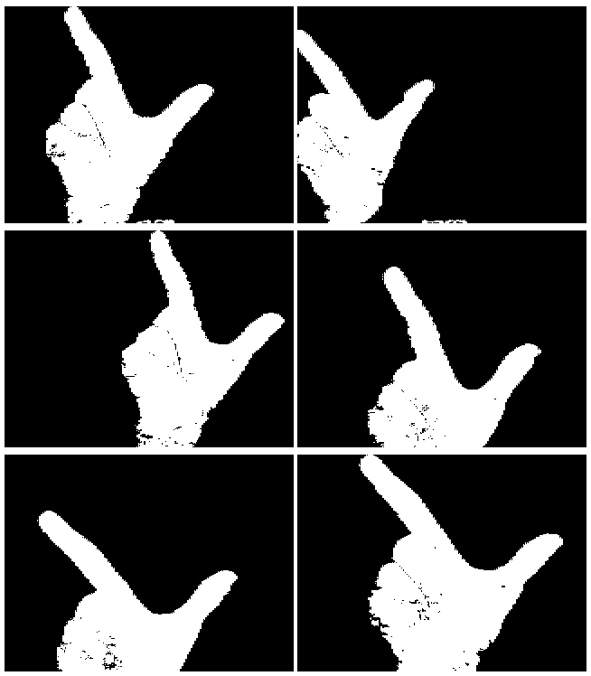

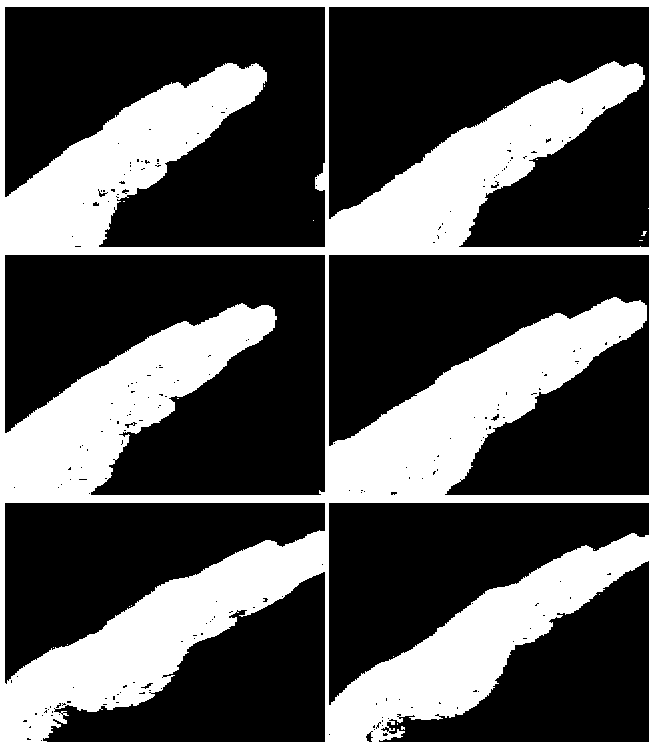

## @the.desert.eagle
